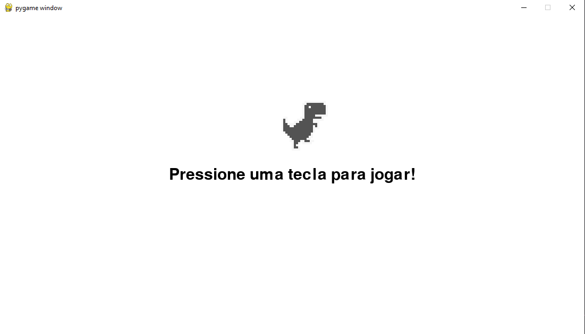
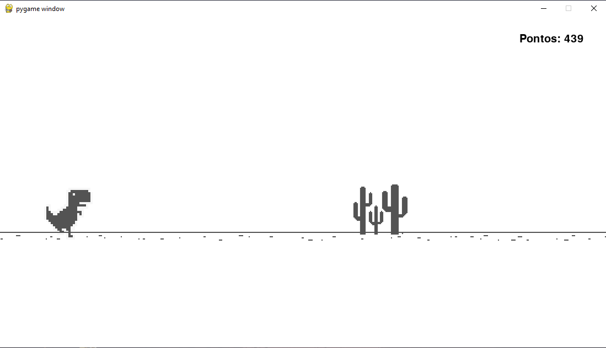
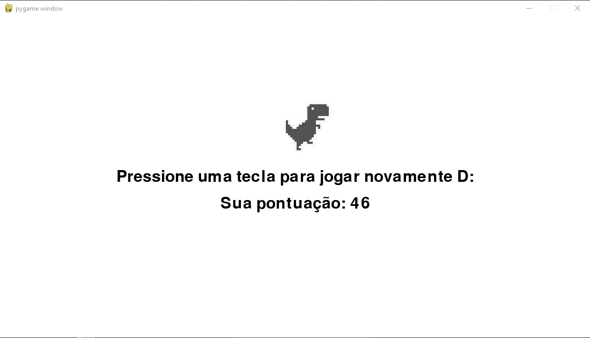

# Dino-Pygame
Jogo do dinossauro 🦖 que pula cactos 🌵 e desvia de passaros 🦅





## Instalação
Para utilizar o código fonte no seu repositório local, use

```bash
git clone https://github.com/dvitorsantos/Dino-Pygame
```

Para iniciar o jogo, entre na pasta src e digite
```bash
python main.py
```
## Licença
[MIT](https://choosealicense.com/licenses/mit/)
